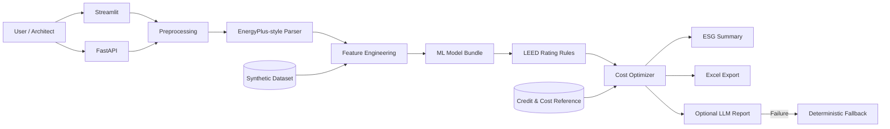

<h1 align="center">LEED Green Building Cost Predictor</h1>

<p align="center">
  건물 성능 데이터를 LEED 점수·등급·추가공사비 예측과<br>
  <strong>최소비용 credit 조합 및 ESG 리포트</strong>로 연결하는 ML 의사결정 지원 프로토타입
</p>

<p align="center">
  <a href="#quick-start"><strong>실행하기</strong></a>
  ·
  <a href="docs/case-study.md"><strong>Case Study</strong></a>
  ·
  <a href="api/README.md"><strong>FastAPI 문서</strong></a>
  ·
  <a href="#ml-실험-결과"><strong>ML 실험 결과</strong></a>
</p>

<p align="center">
  
  
  
  
  
  
</p>

> 이 프로젝트는 **synthetic dataset 기반 포트폴리오 프로토타입**입니다. 공식 LEED 인증 도구가 아니며 USGBC 심사, 실제 견적 또는 투자 판단을 대체하지 않습니다.

---

## 프로젝트 소개

LEED 인증 초기 검토에서는 건물 기본정보, 에너지 성능, 예상 점수, 추가공사비와 ESG 지표를 함께 판단해야 합니다. 하지만 입력은 에너지 시뮬레이션 결과, 인증 항목표와 비용 가정처럼 서로 다른 형태로 분산돼 있습니다.

이 프로젝트는 해당 문제를 다음의 하나의 workflow로 연결합니다.

```text
건물 기본정보 + EnergyPlus-style CSV
    → 에너지·비용·CO₂ 파생지표 계산
    → LEED 점수·등급·추가공사비 예측
    → 목표 등급까지의 score gap 계산
    → 최소비용 credit 조합 추천
    → ESG Dashboard·Excel·API 응답
```

수치 계산은 rule·ML model·cost optimizer가 담당하고, LLM은 검증된 결과를 설명하는 선택적 report layer로만 제한했습니다.

## 핵심 결과

| Task | Baseline 대비 결과 | 최종 선택 기준 |
| --- | ---: | --- |
| LEED 점수 회귀 | MAE 38.2% 감소, R² +0.60 | 높은 R², 낮은 MAE |
| 추가공사비 회귀 | MAE 79.0% 감소, R² +0.95 | 높은 R², 낮은 MAE |
| 등급 분류 | Macro F1 +20.6pp, Weighted F1 +9.2pp | class imbalance를 고려한 Macro F1 |
| 자동 검증 | 15 tests passed | 전처리·등급·최적화·API 실패 경로 |

등급 분류의 accuracy는 most-frequent dummy baseline보다 8.9pp 낮아졌습니다. 다수 class만 맞히는 모델보다 소수 class를 함께 구분하는 모델을 선택하기 위해 accuracy가 아닌 Macro F1을 우선했습니다.

> 모든 수치는 생성된 synthetic dataset 내부의 상대 비교입니다. 실제 LEED 인증 성능이나 실제 건설비 예측 정확도를 의미하지 않습니다.

## 주요 기능

### 1. LEED reference layer

- prerequisite, credit category와 rating threshold 관리
- category별 최대 점수와 목표 등급 기준 제공
- ML 예측과 분리된 규칙 기반 score gap 계산
- reference CSV를 통한 항목·비용 가정 추적

### 2. EnergyPlus-style 데이터 분석

- baseline·proposed energy consumption 입력
- energy saving rate 계산
- annual energy cost saving 계산
- emissions factor 기반 CO₂ reduction 추정
- 실제 EnergyPlus 실행이 아닌 output CSV 분석 경계 유지

### 3. ML 예측 파이프라인

- LEED total score regression
- LEED rating classification
- additional construction cost regression
- Dummy·Linear·RandomForest·GradientBoosting 비교
- stratified split과 class weight를 통한 불균형 대응
- task별 평가지표와 feature importance 저장

### 4. 최소비용 credit 추천

- 현재 점수와 목표 등급 사이의 gap 계산
- 사용 가능한 credit의 예상 cost per point 계산
- 낮은 단가 순으로 목표 점수를 채우는 조합 추천
- 목표 달성 가능 여부와 예상 추가비용 반환

현재 구현은 greedy cost-per-point 방식입니다. Credit 간 선후관계, 상호배타 조건과 실제 공사 단가가 필요한 정수계획 최적화는 향후 범위입니다.

### 5. Dashboard·Excel·API

- Streamlit project input과 결과 dashboard
- 모델 실험 비교와 feature importance
- Energy·cost·CO₂·water·material·IEQ ESG summary
- 입력·예측·추천·ESG·sample을 Excel로 export
- FastAPI `/predict`, `/recommend`
- OpenAI API 실패 시 deterministic report fallback

## 기술 스택

| 영역 | 기술 | 역할 |
| --- | --- | --- |
| UI | Streamlit | 입력·예측·추천·ESG 결과 탐색 |
| Data | pandas, NumPy | CSV 전처리와 파생지표 계산 |
| ML | scikit-learn, joblib | 모델 비교·선택·저장·예측 |
| Visualization | Matplotlib | 실험·feature importance·confusion matrix |
| API | FastAPI, Pydantic | 예측·추천 계약과 입력 검증 |
| Reporting | OpenAI API optional | 계산 완료 JSON의 자연어 설명 |
| Export | openpyxl | 결과 workbook 생성 |
| Test | pytest | rule·parser·optimizer·API 회귀 검증 |

## 아키텍처

예측과 계산을 LLM에서 분리해 같은 입력에 대해 수치 결과를 재현할 수 있도록 구성했습니다.



### 책임 분리

| 결과 | 담당 component |
| --- | --- |
| 에너지 절감률·비용 절감·CO₂ 감소 | deterministic preprocessing |
| LEED 점수·등급·추가공사비 | trained ML models |
| 목표 등급 gap | LEED rating rules |
| Credit 조합·예상비용 | cost optimizer |
| 자연어 설명 | optional LLM report |

LLM이 점수나 비용을 직접 만들지 않기 때문에 API key가 없거나 provider 호출이 실패해도 핵심 예측·추천 결과는 유지됩니다.

## ML 실험 결과

### 비교 전략

```text
Dummy baseline
    ↓
Linear / Logistic model
    ↓
RandomForest
    ↓
GradientBoosting
    ↓
Task별 metric 기준 최종 모델 선택
```

- 회귀: R² 우선, 동률일 때 MAE
- 분류: Macro F1 우선, 동률일 때 accuracy
- 분류 train/test split: stratified
- 적용 가능한 classifier: `class_weight="balanced"`


### 해석 가능성

점수·비용 model의 feature importance와 등급 분류 confusion matrix를 report artifact로 저장합니다.

| Score feature importance | Cost feature importance |
| --- | --- |
|  |  |


전체 결과는 다음 파일에서 확인할 수 있습니다.

- [`reports/model_experiments.csv`](reports/model_experiments.csv)
- [`reports/model_improvement_summary.md`](reports/model_improvement_summary.md)
- [`reports/rating_classification_report.txt`](reports/rating_classification_report.txt)
- [`reports/feature_importance_score.csv`](reports/feature_importance_score.csv)
- [`reports/feature_importance_cost.csv`](reports/feature_importance_cost.csv)

## Streamlit 화면

| 화면 | 제공 기능 |
| --- | --- |
| Project Input | 건물 유형·기후·면적·에너지·ESG 변수 입력 |
| LEED Reference | prerequisite·credit·rating threshold 확인 |
| EnergyPlus Analysis | energy saving·cost saving·CO₂ reduction |
| ML Prediction | 점수·등급·추가공사비 예측 |
| Cost Recommendation | 목표 등급까지 최소비용 credit 추천 |
| ESG Summary | 에너지·물·재료·IEQ 지표 |
| Excel Export | 입력부터 추천까지 workbook 생성 |

## FastAPI

Streamlit MVP의 핵심 예측·추천 흐름을 HTTP API로도 제공합니다.

| Method | Endpoint | 설명 |
| --- | --- | --- |
| `GET` | `/health` | API 상태 확인 |
| `POST` | `/predict` | 점수·등급·비용·에너지 지표 예측 |
| `POST` | `/recommend` | 예측, 최소비용 credit와 설명 report 반환 |

```bash
uvicorn api.main:app --reload
```

OpenAI API key는 선택사항입니다. key가 없거나 호출에 실패하면 `/recommend`는 deterministic fallback report를 반환합니다. 상세 계약은 [FastAPI 확장 문서](api/README.md)를 참고합니다.

## 프로젝트 구조

```text
.
├── app.py                        # Streamlit dashboard
├── api/
│   ├── main.py                   # FastAPI endpoints
│   ├── schemas.py                # Request/response contracts
│   └── llm_report.py             # Optional explanation layer
├── src/
│   ├── data_generator.py         # Synthetic project generator
│   ├── energyplus_parser.py      # Energy output metrics
│   ├── feature_engineering.py    # ML feature pipeline
│   ├── train_models.py           # Benchmark and model selection
│   ├── predict.py                # Inference
│   ├── rating.py                 # LEED threshold rules
│   ├── cost_optimizer.py         # Credit recommendation
│   ├── esg_report.py             # ESG summary
│   └── excel_exporter.py         # Workbook export
├── data/                         # Synthetic inputs and references
├── reports/                      # Metrics and visualizations
├── docs/case-study.md            # Research-to-MVP mapping
└── tests/                        # 15 automated tests
```

## Quick Start

### 1. 환경 구성

```bash
python -m venv .venv
```

Windows PowerShell:

```powershell
.\.venv\Scripts\Activate.ps1
python -m pip install -r requirements.txt
```

macOS/Linux:

```bash
source .venv/bin/activate
python -m pip install -r requirements.txt
```

### 2. 데이터·모델·report 생성

```bash
python -m src.data_generator
python -m src.train_models
python -m src.visualize_reports
```

### 3. 테스트

```bash
python -m pytest -q -p no:cacheprovider
```

### 4. Streamlit 실행

```bash
streamlit run app.py
```

모델 또는 sample data가 없으면 Streamlit 앱이 첫 실행에 생성합니다. 위 명령을 먼저 실행하면 학습과 report 생성 단계를 명시적으로 재현할 수 있습니다.

## 연구에서 구현으로

LEED credit targeting을 supervised ML 문제로 다룬 연구에서 문제 정의, project·climate feature 관점, model benchmark와 feature importance 접근을 참고했습니다.

이 프로젝트는 해당 논문을 재현하지 않습니다. 실제 USGBC·NCEI 데이터 대신 synthetic building record와 EnergyPlus-style 지표를 사용해 포트폴리오 규모로 축소했습니다.

| Research approach | Portfolio MVP |
| --- | --- |
| USGBC certified project data | Synthetic green building projects |
| NCEI climate variables | EnergyPlus-style energy indicators |
| LEED points prediction | Score regression·rating classification |
| Model comparison | Dummy·Linear·RandomForest·GradientBoosting |
| Feature importance | Score·cost report artifacts |

자세한 배경과 mapping은 [Research-backed Case Study](docs/case-study.md)에 있습니다.

## 설계 결정과 Trade-off

| 결정 | 선택 | 감수한 한계 |
| --- | --- | --- |
| 데이터 | Synthetic generator | 재현 가능하지만 실제 인증 분포를 대표하지 않음 |
| EnergyPlus | Output-style CSV 분석 | 빠른 MVP 대신 simulation engine 직접 실행 미지원 |
| 모델 선택 | Baseline부터 task별 비교 | 고급 tuning보다 비교 근거와 해석 가능성 우선 |
| 등급 지표 | Macro F1 우선 | Most-frequent baseline보다 accuracy가 낮아짐 |
| 추천 | Greedy cost per point | Credit dependency·상호배타·예산 제약을 완전히 표현하지 못함 |
| LLM | 설명 전용 optional layer | 자연어 유연성보다 수치 재현성과 fallback 우선 |
| UI | Streamlit | 빠른 검증 대신 독립 frontend·인증·다중 사용자 미지원 |

## 현재 한계와 다음 과제

- 공식 LEED 인증 도구가 아니며 USGBC 심사를 대체하지 않습니다.
- 실제 client, building, USGBC, NCEI 또는 vendor cost data를 사용하지 않습니다.
- 실제 EnergyPlus simulation을 실행하지 않습니다.
- Cost는 quantity survey나 vendor quote가 아닌 synthetic assumption입니다.
- 모델 지표는 생성 데이터 분포 내부에서만 의미가 있습니다.
- Category별 credit 획득 여부 예측과 prerequisite dependency는 제한적입니다.
- 실제 SaaS를 위한 사용자 인증, DB persistence, 비동기 학습과 배포 자동화가 없습니다.
- 실제 데이터 확보 후 temporal·regional validation과 model monitoring이 필요합니다.

## 문서

- [Research-backed Case Study](docs/case-study.md)
- [Model Improvement Summary](reports/model_improvement_summary.md)
- [FastAPI Extension](api/README.md)
- [Model Experiment CSV](reports/model_experiments.csv)

---

<p align="center">
  모델 정확도만 보여주기보다 <strong>데이터 경계, baseline 비교, 계산 책임과 한계</strong>를 함께 설명하는 프로젝트입니다.
</p>
