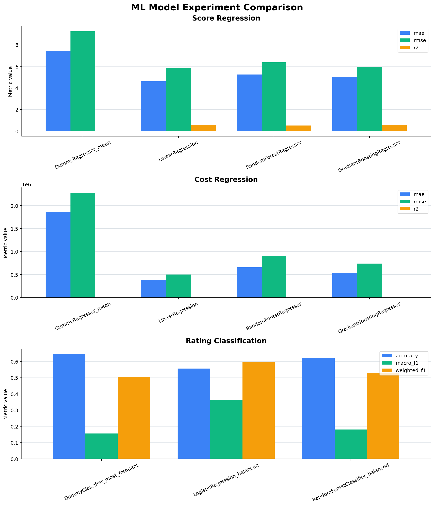
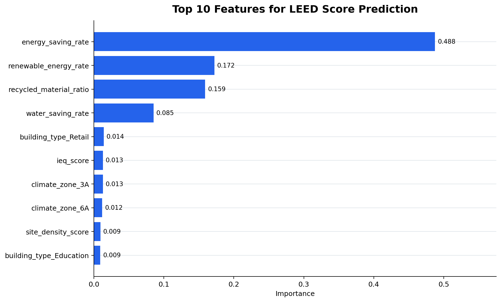
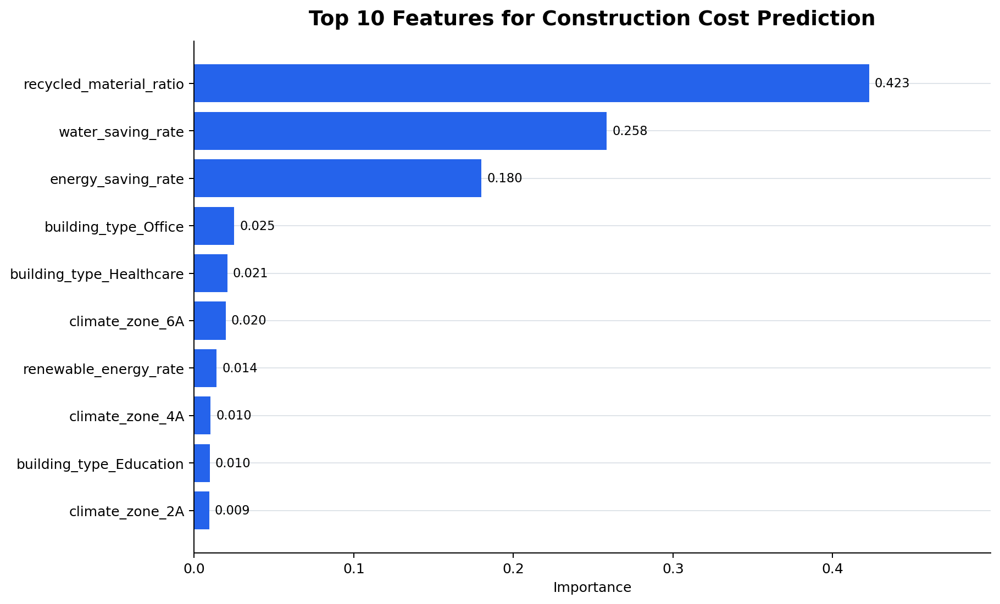
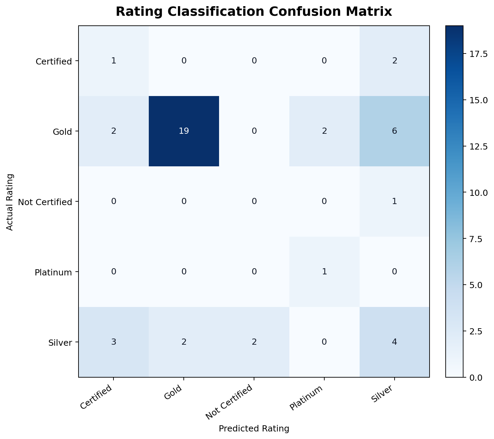

# LEED Green Building Cost Predictor

이 프로젝트는 AI 기반 플랫폼 개발 연구원 포지션 지원을 위해 제작한 친환경 건축 인증 예측 포트폴리오입니다.  
공식 LEED Scorecard 구조를 참고한 reference layer, EnergyPlus-style CSV 분석, 머신러닝 기반 LEED 점수/등급/추가공사비 예측, 최소비용 credit 추천, ESG Summary Dashboard를 구현했습니다.

본 프로젝트는 실제 LEED 인증 도구가 아니며, synthetic dataset을 활용한 포트폴리오용 프로토타입입니다.

Python Streamlit portfolio project for AI-based LEED score prediction, EnergyPlus-style CSV analysis, construction cost prediction, credit recommendation, and ESG reporting.

This project is aimed at an AI platform developer portfolio context. It demonstrates how a SaaS-style AI module could combine reference rules, simulation output preprocessing, machine learning, optimization logic, and exportable reporting.

## What It Does

- Uses a rule-based LEED reference layer for prerequisites, credit categories, rating thresholds, and category-level maximum points.
- Analyzes EnergyPlus-style output CSV data with:
  - `baseline_energy_kwh`
  - `proposed_energy_kwh`
  - `energy_saving_rate`
  - `annual_energy_cost_saving`
  - `estimated_co2_reduction`
- Trains scikit-learn models for:
  - LEED total score regression
  - LEED rating classification
  - Additional construction cost regression
- Reports model metrics:
  - MAE
  - RMSE
  - R2
  - Accuracy
  - Classification report
- Recommends minimum-cost credit combinations to close the gap to a target rating.
- Provides an ESG summary dashboard for energy, cost, CO2, water, recycled materials, and indoor environmental quality.
- Exports project inputs, predictions, recommendations, ESG summary, and portfolio samples to Excel.

## Project Structure

```text
leed-green-building-cost-predictor/
├── app.py
├── README.md
├── requirements.txt
├── data/
│   ├── leed_credit_reference.csv
│   ├── prerequisite_reference.csv
│   ├── sample_projects.csv
│   ├── energyplus_sample_outputs.csv
│   └── cost_assumptions.csv
├── models/
├── reports/
│   ├── model_experiments.csv
│   ├── feature_importance_score.csv
│   ├── feature_importance_cost.csv
│   ├── rating_classification_report.txt
│   ├── rating_confusion_matrix.csv
│   └── visualizations/
│       ├── model_experiment_comparison.png
│       ├── feature_importance_score.png
│       ├── feature_importance_cost.png
│       └── rating_confusion_matrix.png
├── src/
│   ├── __init__.py
│   ├── data_generator.py
│   ├── preprocessing.py
│   ├── energyplus_parser.py
│   ├── feature_engineering.py
│   ├── train_models.py
│   ├── visualize_reports.py
│   ├── predict.py
│   ├── rating.py
│   ├── cost_optimizer.py
│   ├── esg_report.py
│   └── excel_exporter.py
└── tests/
    ├── test_energyplus_parser.py
    ├── test_feature_engineering.py
    ├── test_rating.py
    └── test_cost_optimizer.py
```

## Quick Start

Create and activate a virtual environment, then install dependencies:

```bash
pip install -r requirements.txt
```

Run the local prototype workflow:

```bash
python -m src.data_generator
python -m src.train_models
python -m src.visualize_reports
pytest
streamlit run app.py
```

This sequence regenerates the synthetic dataset, trains the local ML models, creates report visualizations, runs tests, and starts the Streamlit prototype.

The Streamlit app also generates missing sample data and trains missing models on first run, but running the commands above makes the portfolio demo outputs explicit.

## Optional FastAPI + OpenAI API Extension

Current MVP is Streamlit-based.

A lightweight FastAPI backend extension exposes prediction and recommendation endpoints. OpenAI API is used only as an optional natural-language reporting layer.

Numerical prediction and optimization are handled by deterministic backend functions and trained ML models. This separates LLM explanation from numerical calculation to reduce hallucination risk.

Run the optional API extension:

```bash
uvicorn api.main:app --reload
```

## Architecture

The system separates reference logic from predictive logic.

The reference layer in `src/rating.py` represents public LEED scorecard concepts such as prerequisites, category score structures, and rating thresholds. It is used for interpretability and target-gap calculations. It is not treated as the primary prediction engine.

The predictive layer uses synthetic project records and EnergyPlus-style CSV metrics. `src/train_models.py` runs a
small ML experiment pipeline and compares baseline and improved models:

- Score regression: `DummyRegressor`, `LinearRegression`, `RandomForestRegressor`, `GradientBoostingRegressor`
- Cost regression: `DummyRegressor`, `LinearRegression`, `RandomForestRegressor`, `GradientBoostingRegressor`
- Rating classification: `DummyClassifier`, `LogisticRegression`, `RandomForestClassifier`

The cost optimizer in `src/cost_optimizer.py` calculates the score gap to a selected target rating, sorts available credit candidates by estimated cost per point, and recommends the lowest-cost credit set that can close the gap.

## ML Modeling Approach

- Synthetic dataset generation based on green building assumptions
- EnergyPlus-style output preprocessing for energy saving, annual cost saving, and CO2 reduction
- Feature engineering across building metadata, energy metrics, water/material indicators, IEQ score, renewable energy, and site density
- Baseline model comparison using dummy and linear models before ensemble models
- Ensemble model selection using Random Forest and Gradient Boosting candidates
- Evaluation metrics saved to `reports/model_experiments.csv`
- Feature importance exports for selected score and cost models when supported by the final estimator

Generated ML reports:

```text
reports/model_experiments.csv
reports/feature_importance_score.csv
reports/feature_importance_cost.csv
reports/rating_classification_report.txt
reports/rating_confusion_matrix.csv
```

## ML Experiment Summary

Generate PNG charts from the saved ML report CSV files after running the model training step:

```bash
python -m src.visualize_reports
```

Baseline-to-final improvement summary from `reports/model_experiments.csv`:

| Task | Baseline | Final selected model | Improvement summary |
| --- | --- | --- | --- |
| LEED score regression | `DummyRegressor_mean` | `LinearRegression` | MAE -38.2%, RMSE -36.4%, R2 +0.60 |
| Additional cost regression | `DummyRegressor_mean` | `LinearRegression` | MAE -79.0%, RMSE -77.9%, R2 +0.95 |
| Rating classification | `DummyClassifier_most_frequent` | `LogisticRegression_balanced` | Accuracy -8.9pp, macro F1 +20.6pp, weighted F1 +9.2pp |

The rating classifier is selected on macro F1 rather than raw accuracy because the synthetic rating labels are imbalanced. These metrics compare models within the generated synthetic dataset only and should not be presented as production-level accuracy.









## Model Improvement Process

- Compare Dummy/Linear baselines against ensemble models.
- Select score and cost regression models using highest R2, then lowest MAE.
- Select rating classification model using highest macro F1, then Accuracy.
- Use stratified train/test split and `class_weight='balanced'` for applicable classifiers to reduce class imbalance impact.
- Store the selected final models in `models/model_bundle.joblib`.
- Do not claim production-level accuracy because the current dataset is synthetic and generated for portfolio demonstration.

## Data

All included data is synthetic. It is generated by `src/data_generator.py` and is designed to look like a plausible building-performance and LEED portfolio dataset for local development and demonstration.

No real client, company, building, USGBC, or EnergyPlus dataset is included.

## Streamlit Pages

- Project input form
- Rule-based LEED reference
- EnergyPlus-style CSV analysis
- LEED score and rating prediction
- Additional construction cost prediction
- Model experiment comparison
- Feature importance review
- Minimum-cost credit recommendation
- ESG summary dashboard
- Excel export

## Important Limitations

- This is not an official LEED certification tool.
- This does not replace USGBC review.
- The dataset is synthetic and should not be used for real certification or financial decisions.
- EnergyPlus is not directly executed. The project analyzes EnergyPlus-style output CSV files.
- Cost assumptions are synthetic portfolio assumptions, not vendor quotes or quantity-survey estimates.
- Model accuracy is only meaningful within the synthetic data distribution generated for this demo.

## Portfolio Notes

This project intentionally avoids claiming that it reflects a current or production SaaS service. Any older EcoBuild SaaS demo screenshots should be treated only as problem-structure references for possible input/output flow, dashboard layout, and feature scope.
